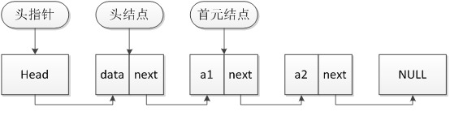
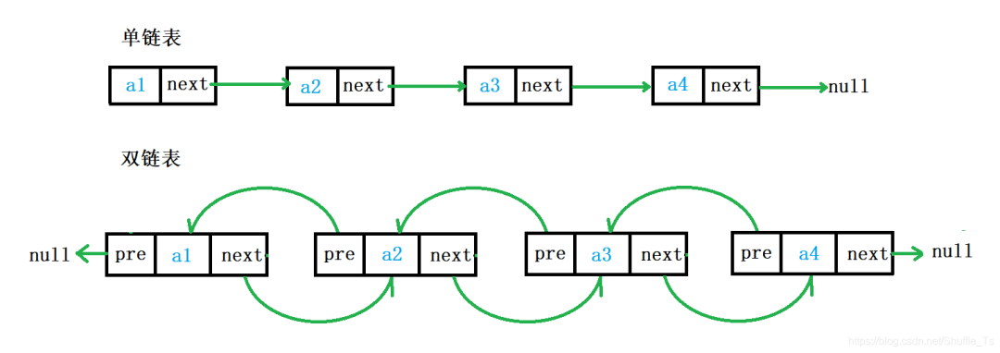
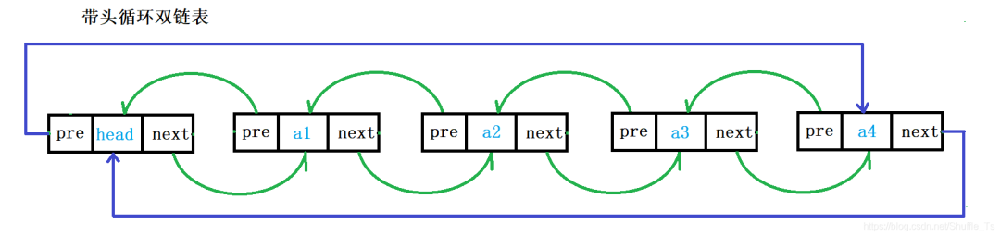
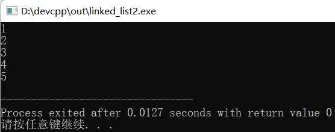
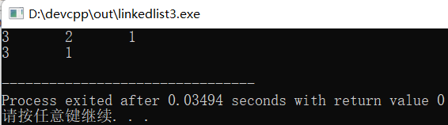
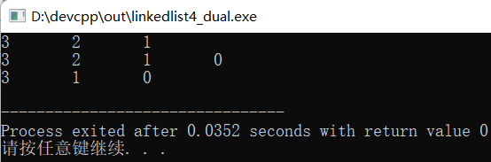

# C语言链表实现


## 链表

## 链表 - HQ

[TOC]

------

#### 注意

- 

------

链表是常用的数据结构，为方便学习，对链表进行细分，分为五种：

1、不带头节点的单链表
2、带头节点的单链表
3、不带头结点的双链表
4、带头结点的双链表
5、带头结点的双向循环链表

### 链表基本概念



**头指针：**

1. 头指针是指链表指向第一个结点的指针，若链表有头结点，则是指向头结点的指针
2. 头指针具有标识作用，所以常用头指针冠以链表的名字
3. 无论链表是否为空，头指针均不为空，头指针是链表的必要元素

**头节点：**

1. 头结点是为了操作的统一和方便而设立的，放在第一元素的结点之前，其数据域一般无意义(也可存放链表的长度)
2. 有了头结点，对在第一元素结点前插入结点和删除第一结点，其操作与其它结点的操作就统一了
3. 头结点不一定是链表必须要素

#### 单链表和双链表的区别





1. 单链表的每一个节点中只有指向下一个节点的指针，不能进行回溯。
2. 双链表的每一个节点中既有指向下一个节点的指针，也有指向上一个节点的指针，可以快速的找到当前节点的前一个节点。

实际中经常使用的一般为带头双向循环链表。

#### 单链表1

```c
#include<stdio.h>
#include<stdlib.h>

typedef struct node
{
 int data; //"数据域" 保存数据元素
 struct node * next; //保存下一个数据元素的地址
}Node;

void printList(Node *head){
    Node *p = head;
    while(p != NULL){
        printf("%d\n",p->data);
        p = p -> next;
    }
}

int main(){
  
  Node * a = (Node *)malloc(sizeof(Node));
  Node * b = (Node *)malloc(sizeof(Node));
  Node * c = (Node *)malloc(sizeof(Node));
  Node * d = (Node *)malloc(sizeof(Node));
  Node * e = (Node *)malloc(sizeof(Node));
  
  a->data = 1;
  a->next = b;
  
  b->data = 2;
  b->next = c;
  
  c->data = 3;
  c->next = d;
  
  d->data = 4;
  d->next = e;
  
  e->data = 5;
  e->next = NULL;
  
  printList(a);
}
```

结果：



这个链表比较简单，实现也很原始，只有创建节点和遍历链表，大家一看就懂！

#### 单链表2

这个链表功能多一点：

1. 创建链表
2. 创建节点
3. 遍历链表
4. 插入元素
5. 删除元素

```c
#include<stdio.h>
#include<stdlib.h>

typedef struct node
{
 int data; //"数据域" 保存数据元素
 struct node * next; //保存下一个数据元素的地址
}Node;

//创建链表，即创建表头指针 
Node* creatList()
{
 Node * HeadNode = (Node *)malloc(sizeof(Node));
 //初始化
 HeadNode->next = NULL;
 return HeadNode;
}

//创建节点 
Node* creatNode(int data)
{
 Node* newNode = (Node *)malloc(sizeof(Node));
 //初始化
 newNode->data = data;
 newNode->next = NULL;
 return newNode;
}

//遍历链表
void printList(Node *headNode){
    Node *p = headNode -> next;
    while(p != NULL){
        printf("%d\t",p->data);
        p = p -> next;
    }
    printf("\n");
}

//插入节点：头插法
void insertNodebyHead(Node *headNode,int data){
 //创建插入的节点 
    Node *newnode = creatNode(data);

    newnode -> next = headNode -> next;
    headNode -> next = newnode;
}

//删除节点
void deleteNodebyAppoin(Node *headNode,int posData){
 // posNode 想要删除的节点，从第一个节点开始遍历 
 // posNodeFront 想要删除节点的前一个节点 
    Node *posNode = headNode -> next;
    Node *posNodeFront = headNode;
    
 if(posNode == NULL)
  printf("链表为空，无法删除");
 else{
  while(posNode->data != posData)
  {
   //两个都往后移，跟着 posNodeFront 走 
   posNodeFront = posNode;  
   posNode = posNodeFront->next;
   if (posNode == NULL)
   {
    printf("没有找到，无法删除");
    return; 
   }
  }
  //找到后开始删除 
  posNodeFront->next = posNode->next;
  free(posNode);
 } 
}

int main(){
 
 Node* List = creatList();
 
 insertNodebyHead(List,1); 
 insertNodebyHead(List,2); 
 insertNodebyHead(List,3);  
 printList(List);
 
 deleteNodebyAppoin(List,2);
 printList(List);
 
 return 0;
}
```

结果：



大家从最简单的单链表开始，学习链表的增删改查，然后再学习双链表，最后学习双向循环链表。

#### 双向循环链表demo

```
#include<stdio.h>
#include<stdlib.h>

typedef struct node
{
 int data; //"数据域" 保存数据元素
 struct node * next; //保存下一个数据元素的地址
 struct node * prev; //保存上一个数据元素的地址
}Node;

//创建表头表示链表 
Node* creatList()
{
 Node * HeadNode = (Node *)malloc(sizeof(Node));
 //初始化，自己指向自己 
 HeadNode->next = HeadNode->prev = HeadNode;
 return HeadNode;
}
//创建节点 
Node* creatNode(int data)
{
 //C语言：malloc + free 
 //C++：new + delete 
 Node* newNode = (Node *)malloc(sizeof(Node));
 //初始化
 newNode->data = data;
 newNode->next = NULL;
 newNode->prev = NULL;
 return newNode;
}
//遍历链表
void printList(Node *headNode)
{
 //双向链表不光可以用 next 打印，也可以用 prev 进行打印
 //next指针打印：先进后出   
 //prev指针打印：先进先出 
    Node *p = headNode -> next;
    while(p != headNode){
        printf("%d\t",p->data);
        p = p -> next;
    }
    printf("\n");
}

//插入节点：头插法
void insertNodebyHead(Node *headNode,int data)
{
 //创建插入的节点 
    Node *newNode = creatNode(data);
 //注意顺序，赋值会改变指针指向，因此要先连后断 
 /*
 headNode -> next =  newnode;
 newnode -> prev = headNode;
 newnode -> next = headNode -> next;
 headNode ->next->prev = newNode;
 */
 // 从上面调整顺序，得到下面 
 newNode -> prev = headNode;
 newNode -> next = headNode -> next;
 headNode ->next->prev = newNode;
 headNode -> next =  newNode;
}

//插入节点：尾插法 
void insertNodebyTail(Node *headNode,int data)
{
 //创建插入的节点 
 Node *newNode = creatNode(data);
    
 //找到最后一个节点
 Node *lastNode = headNode;
 while(lastNode->next != headNode)
 {
  lastNode = lastNode->next;//往下走 
 }
 
 //注意顺序
 headNode->prev =  newNode;
 newNode->next = headNode;
 lastNode->next = newNode;
 newNode->prev = lastNode;

}

//删除节点
void deleteNodebyAppoin(Node *headNode,int posData)
{
 // posNode 想要删除的节点，从第一个节点开始遍历 
 // posNodeFront 想要删除节点的前一个节点 
    Node *posNode = headNode -> next;
    Node *posNodeFront = headNode;
    
 if(posNode == NULL)
  printf("链表为空，无法删除");
 else{
  while(posNode->data != posData)
  {
   //两个都往后移，跟着 posNodeFront 走 
   posNodeFront = posNode;  
   posNode = posNodeFront->next;
   if (posNode->next == headNode)
   {
    printf("没有找到，无法删除");
    return; 
   }
  }
  //找到后开始删除 
  posNodeFront->next = posNode->next;
  posNode->next->prev = posNodeFront;
  free(posNode);
 } 
}

int main()
{
 Node* List = creatList();
 
 insertNodebyHead(List,1); 
 insertNodebyHead(List,2); 
 insertNodebyHead(List,3);  
 printList(List);
 
 insertNodebyTail(List,0); 
 printList(List);
 
 deleteNodebyAppoin(List,2);
 printList(List);
 
 return 0;
}
```

结果：



双链表的创建、遍历和单链表差不多，只是头插法、尾插法、删除操作多了几个步骤。


---


## UNIX内核源码_通用链表

- [一、结构体的高级部分](#一结构体的高级部分)
  - [1.1、一段如下代码](#11一段如下代码)
  - [1.2、运行结果](#12运行结果)
  - [1.3、模型解释](#13模型解释)
- [二、三种链表的分析](#二三种链表的分析)
- [三、通用链表的实现](#三通用链表的实现)
  - [3.1、linkList.h 代码如下](#31linklisth-代码如下)
  - [3.2、运行结果](#32运行结果)
  - [3.3、核心思想](#33核心思想)
- [四、说明](#四说明)

## 一、结构体的高级部分

### 1.1、一段如下代码

```c
#include<stdio.h>

typedef struct Teacher{
    char name[64];
    int age;  //求age的偏移量
    int p;
    char *pname;
}Teacher;

int main(void){
//  Teacher *p = NULL;
    Teacher s;
    Teacher *p; 
    p = &s; 
//  int offsize = (int)&(p->age);
//  int offsize = (int)&(((Teacher *)0)->age); 利用映射到0地址空间,求其相对的偏移量大小;
    int offsize = (int)&(p->age) - (int)p;   //利用内存地址直接定位,求偏移的字节数
    printf("%d\n", offsize);
    
    return 0;
}
```

### 1.2、运行结果

<div align=center></div>

</br>

从结果来看，此时age结构体变量相当于结构体而言，偏移量为64字节。

### 1.3、模型解释

<div align=center></div>

## 二、三种链表的分析

1. **传统链表；**
2. **Linux内核链表：使用的就是结构体的偏移量技术来定位的；**
3. **通用链表：因为结构体的第一个成员变量的地址和结构体的地址是同一个地址，所以放一个结构体，内部只有一个成员变量指针，用来进行链表的操作，将具体的算法和数据类型相分离；实现了一种"我不包含万物，万物包含我的"哲学思想；**

模型图如下：
<div align=center></div>

通用链表的模型图：
<div align=center></div>

## 三、通用链表的实现

### 3.1、linkList.h 代码如下

```c
#ifndef _LINK_LIST_H_
#define _LINK_LIST_H_
#include<malloc.h>
#include<string.h>
typedef void LinkList; 


//核心思想：在用户级别可能自定义数据类型,而底层的实现则是通过void *类型接受用户的数据类型;(void * 可以
接受任何类型的指针类型),最后在通过强制类型转换到相应的数据类型进行使用!!!
typedef struct LINK_NODE{
    struct LINK_NODE *next;
}LINK_NODE;


typedef struct HEAD{
    LINK_NODE head;
    int length;
}HEAD;

LinkList *LinkList_Create();
void LinkList_Destroy(LinkList *list);
void LinkList_Clear(LinkList *list);
int LinkList_Length(LinkList *list);
int LinkList_Insert(LinkList *list, LINK_NODE *node, int pos);
LINK_NODE *LinkList_Get(LinkList *list, int pos);
LINK_NODE *LinkList_Delete(LinkList *list, int pos);

LinkList *LinkList_Create(){
    HEAD *ret = NULL;

    ret = (HEAD *)malloc(sizeof(HEAD));
    memset(ret, 0, sizeof(HEAD));

    ret->length = 0;
    ret->head.next = NULL;

    return ret;

}
void LinkList_Destroy(LinkList *list){
    if(list != NULL){
        free(list);
        list = NULL;
    }

}
//让链表回到初始值
void LinkList_Clear(LinkList *list){
    HEAD *ret = NULL;
    if(list == NULL){
        return;
    }
    ret = (HEAD *)list;
    ret->length = 0;
    ret->head.next = NULL;
}
int LinkList_Length(LinkList *list){
    HEAD *ret = NULL;
    if(list == NULL){
        return -1;
    }
    ret = (HEAD *)list;
    return ret->length;

}
int LinkList_Insert(LinkList *list, LINK_NODE *node, int pos){
    HEAD *tList;
    int i;
    LINK_NODE *current = NULL;

    if(list == NULL || node == NULL || pos < 0){
        printf("func LinkList_Insert() err\n");
        return -1;
    }

    tList = (HEAD *)list;
    current = &(tList->head);
    for(i = 0; i < pos || current->next != NULL; i++){  
        current = current->next;
    }

    node->next = current->next;
    current->next = node;
    tList->length++;

    return 0;
}
LINK_NODE *LinkList_Get(LinkList *list, int pos){
    int i;
    HEAD *tList;
    LINK_NODE *current = NULL;

    if(list == NULL ||  pos < 0){
        printf("func LinkList_Insert() err\n");
        return NULL;
    }

    tList = (HEAD *)list;
    current = &(tList->head);
    for(i = 0; i < pos && (current->next != NULL); i++){
        current = current->next;
    }

    return current->next;   
}
LINK_NODE *LinkList_Delete(LinkList *list, int pos){
    LINK_NODE *ret = NULL;
    int i;
    HEAD *tList;
    LINK_NODE *current = NULL;

    if(list == NULL ||  pos < 0){
        printf("func LinkList_Insert() err\n");
        return NULL;
    }

    tList = (HEAD *)list;
    current = &(tList->head);
    for(i = 0; i < pos && (current->next != NULL); i++){
        current = current->next;
    }

    ret = current->next;
    current->next = ret->next;
    tList->length--;

    return ret;
}
#endif
```

main.c文件内容

```c
#include<stdio.h>
#include"./linkList.h"

typedef struct Teacher{
    LINK_NODE node;
    int age;
    char name[64];
}Teacher;

int main(void){
    int len;
    int i;
    int ret = 0;
    LinkList *list = NULL;
    Teacher t1, t2, t3, t4, t5; 
    t1.age = 31; 
    t2.age = 32; 
    t3.age = 33; 
    t4.age = 34; 
    t5.age = 35; 

    list = LinkList_Create();
    if(list == NULL){
        return -1; 
    }   

    len = LinkList_Length(list);
    ret = LinkList_Insert(list, (LINK_NODE *)&t1, 0); //采用的是头插法
    ret = LinkList_Insert(list, (LINK_NODE *)&t2, 0); //采用的是头插法
    ret = LinkList_Insert(list, (LINK_NODE *)&t3, 0); //采用的是头插法
    ret = LinkList_Insert(list, (LINK_NODE *)&t4, 0); //采用的是头插法
    ret = LinkList_Insert(list, (LINK_NODE *)&t5, 0); //采用的是头插法

    //遍历
    for(i = 0; i < LinkList_Length(list); i++){
        Teacher *tmp = (Teacher *)LinkList_Get(list, i);
        if(tmp == NULL){
            return -1;
        }
        printf("%d: ", tmp->age);
    }
    printf("\n");

    //printf("salkjfdkl\n");
    //删除链表
    while(LinkList_Length(list) > 0){
        LinkList_Delete(list, 0);
    }

    printf("hello\n");
    return 0;
}
```

### 3.2、运行结果

<div align=center></div>

### 3.3、核心思想

**将数据类型与数据结构分离开来，我们在内部实现具体的链表各种操作，提供给外面一个接口，满足不同业务的数据类型的需求，从而达到一种高效的开发。**

## 四、说明

原创文章链接：[UNIX内核源码---通用链表](https://mp.weixin.qq.com/s?__biz=MzUxMzkyNDk0Ng==&mid=2247483702&idx=1&sn=07ce1728cf648a05b96878c046c202d6&chksm=f94c8b0bce3b021dd1798232c7067b29767aab2f43f95cf895b5710addf91f3720faf4d8031f&scene=21#wechat_redirect)


---
