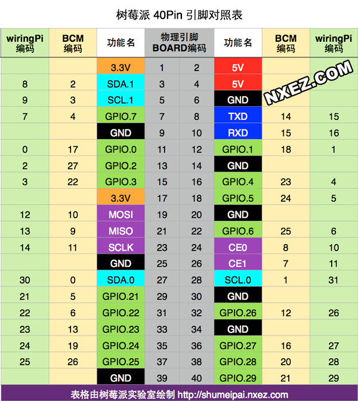
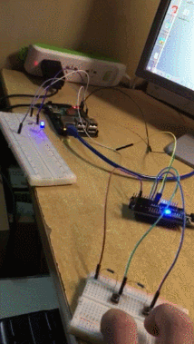

# 树莓派wiringPi库应用开发


## 树莓派wiringPi库开发


[TOC]

------

#### 注意

- 

------

## wiringPi库使用

### wiringPi库指令

**查看wiringPi库版本**

```
gpio -v
```

> 

**查看树莓派所以引脚状态**

```
gpio readall
```

> 

### 对wiringPi库进行交叉编译（暂时不可行）

通常我们先要交叉编译wiringPi库，编译出的库适合树莓派，这时候再进行交叉编译可执行程序，并链接库（通过-I -L来指定）。

否则会因为链接的库的格式不对，是宿主机的平台，出现以下错误，要把树莓派的wringPI库在ubuntu中交叉编译后进行库链接。

```
arm-linux-gnueabihf-gcc demo2.c -I /home/CLC/lessonPI/WiringPi/wiringPi -lwiringPi

/home/CLC/lessonPI/tools-master/arm-bcm2708/gcc-linaro-arm-linux-gnueabihf-raspbian-x64/bin/../lib/gcc/arm-linux-gnueabihf/4.8.3/../../../../arm-linux-gnueabihf/bin/ld: cannot find -lwiringPi

collect2: error: ld returned 1 exit status
```

由于在网络上搜集到的wiringPi.rar库安装包默认使用gcc编译安装，只适用于x86平台，不适用于arm平台，且此库中不含config等可更改编译选项的配置文件，所以这个库无法使用。

> 使用方法：将wiringPi.rar库压缩包解压缩后拷贝到ubuntu中，阅读README文件说明，运行build脚本安装

### 使用wiringPi库进行交叉编译

1、直接将树莓派中的wiringPi动态库`libwiringPi.so.2.50`拷贝到ubuntu中

> 

2、在ubuntu中新建软连接指向wiringPi动态库

```
ln -s libwiringPi.so.2.50 libwiringPi.so
```

3、在ubuntu中交叉编译程序，交叉编译的同时指定wiringPi动态库

```shell
arm-linux-gnueabihf-gcc xxx.c -I /home/hq/raspberry/wiringPi -L. -lwiringPi -o xxx
```

> `-Ixxx` 的意思是除了默认的头文件搜索路径(比如/usr/include等）外，同时还在路径`xxx`下搜索需要被引用的头文件。 
>
> `gcc -I. -I/usr/xxx`的意思是，同时还要在 `.` 目录（即执行gcc的当前目录） 以及 `/usr/xxx` 目录下搜索头文件。
>
> `-Lxxx`  指定编译的时候，搜索库的路径。比如你自己的库，可以用它制定目录，不然编译器将只在标准库的目录找。这个`xxx`就是目录的名称。
>
> 


## wiringPi库例程汇总

### 例程 - 1 - 串口

serial.c serial2.c

```c
#include <wiringSerial.h>
#include <stdio.h>
#include <wiringPi.h>


int main()
{
    int fd;
    int cmd;
    //树莓派初始化
    wiringPiSetup();
    //Linux中一切皆文件，串口也是文件
    fd = serialOpen("/dev/ttyAMA0",9600);
        
    while(1)
    {
        while(serialDataAvail(fd) != -1)
        {
            cmd = serialGetchar(fd);
            printf("get data =%c\n",cmd);
        }
        //在树莓派中，换行一般是/r/n配合使用
        serialPuts(fd,"YANG HAO QING COOL!\r\n");
        delayMicroseconds(1000000); //1s
    }
    serialClose(fd);
    return 0;
}

#include <wiringSerial.h>
#include <stdio.h>
#include <wiringPi.h>
#include <stdlib.h>
#include <string.h>
#include <unistd.h>
void serialSetup()
{
    if(-1 == wiringPiSetup())
    {
        printf("openSerial error\n");
        exit(-1);
    }
}


int main()
{
    char buf[128] = {'\0'};
    int serialDataCount = 0;
    serialSetup();


    int fd;
    if((fd = serialOpen("/dev/ttyAMA0",9600)) == -1)
    {    printf("serial open failed\n");
        exit(-1);
    }
    while(1)
    {
        serialDataCount = read(fd, buf, sizeof(buf));
        if(serialDataCount == 0)
        {
            printf("nodatas\n");
        }
        else
        {
            printf("getDatas:%s\n",buf);
            memset(buf, '\0', sizeof(buf));
            serialDataCount = 0;
        }
    
    }
    return 0;
}
```


### 例程 - 2 - 继电器

relay1.c

```c
#include <wiringPi.h>
#include <stdio.h>


#define SWITCHER 7
int main()
{


    int cmd = 0;


    if(wiringPiSetup() == -1){
        printf("硬件初始化失败\n");
        return -1;
    }
    pinMode(SWITCHER,OUTPUT);


    digitalWrite(SWITCHER,HIGH);
    while(1)
    {    
        printf("请输入0/1: 0-断开开关 1-导通开关\n");
        scanf("%d",&cmd);
        getchar();
        if(cmd == 1)
        {
            digitalWrite(SWITCHER,LOW);        
        }
        else if(cmd == 0)
        {
            digitalWrite(SWITCHER,HIGH);
        }
        else
        {
            printf("输入错误\n");
        }
    }
}
```


### 例程 - 3 - 超声波传感器

ultrasonic.c

```c
#include <wiringPi.h>
#include <stdio.h>
#include <sys/time.h>
#define Trig    4
#define Echo    5


void ultraInit(void)
{
    pinMode(Echo, INPUT);  //设置端口为输入
    pinMode(Trig, OUTPUT);  //设置端口为输出
}


float disMeasure(void)
{
    struct timeval tv1;  //timeval是time.h中的预定义结构体 其中包含两个一个是秒，一个是微秒
    /*
     *     struct timeval
     *         {
     *                 time_t tv_sec;  //Seconds.
     *                         suseconds_t tv_usec;  //Microseconds.
     *                             };
     *                                 */


    struct timeval tv2;
    long start, stop;
    float dis;


    digitalWrite(Trig, LOW);
    delayMicroseconds(2);


    digitalWrite(Trig, HIGH);
    delayMicroseconds(10);      //发出超声波脉冲
    digitalWrite(Trig, LOW);


    while(!(digitalRead(Echo) == 1));
    gettimeofday(&tv1, NULL);           //获取当前时间 开始接收到返回信号的时候


    while(!(digitalRead(Echo) == 0));
    gettimeofday(&tv2, NULL);           //获取当前时间  最后接收到返回信号的时候
    /*
     *     int gettimeofday(struct timeval *tv, struct timezone *tz);
     *         The functions gettimeofday() and settimeofday() can get and set the time as well as a timezone.
     *             The use of the timezone structure is obsolete; the tz argument should normally be specified as NULL.
     *                 */
    start = tv1.tv_sec * 1000000 + tv1.tv_usec;   //微秒级的时间
    stop  = tv2.tv_sec * 1000000 + tv2.tv_usec;


    dis = (float)(stop - start) / 1000000 * 34000 / 2;  //计算时间差求出距离


    return dis;
}


int main(void)
{
    float dis;


    if(wiringPiSetup() == -1){ //如果初始化失败，就输出错误信息 程序初始化时务必进行
        printf("setup wiringPi failed !");
        return -1;
    }


    ultraInit();


    while(1){
        dis = disMeasure();
        printf("distance = %0.2f cm\n",dis);
        delay(1000);
    }


    return 0;
}
```


### 例程 - 4 - 控制4路继电器

relay_4route.c 4路继电器

```c
#include <wiringPi.h>
#include <stdio.h>
#include <string.h>


#define SWI1 29
#define SWI2 28
#define SWI3 27
#define SWI4 26
int main()
{


    char cmd[12] = {'\0'};


    if(wiringPiSetup() == -1){
        printf("硬件初始化失败\n");
        return -1;
    }
    pinMode(SWI1,OUTPUT);
    pinMode(SWI2,OUTPUT);
    pinMode(SWI3,OUTPUT);
    pinMode(SWI4,OUTPUT);


    digitalWrite(SWI1,HIGH);
    digitalWrite(SWI2,HIGH);
    digitalWrite(SWI3,HIGH);    
    digitalWrite(SWI4,HIGH);
    
    while(1)
    {
        printf("请输入1/2/3/4: off-断开开关 on-导通开关\n");
        memset(cmd,'\0',sizeof(cmd));   //初始化整个字符数组
    //    scanf("%s",cmd);
        gets(cmd);
        if(strcmp(cmd,"1 on") == 0)
        {
            digitalWrite(SWI1,LOW);        
        }
        else if(strcmp(cmd,"1 off") == 0)
        {
            digitalWrite(SWI1,HIGH);
        }
        
        if(strcmp(cmd,"2 on") == 0)
        {
            digitalWrite(SWI2,LOW);        
        }
        else if(strcmp(cmd,"2 off") == 0)
        {
            digitalWrite(SWI2,HIGH);
        }
        
        if(strcmp(cmd,"3 on") == 0)
        {
            digitalWrite(SWI3,LOW);        
        }
        else if(strcmp(cmd,"3 off") == 0)
        {
            digitalWrite(SWI3,HIGH);
        }
        
        if(strcmp(cmd,"4 on") == 0)
        {
            digitalWrite(SWI4,LOW);        
        }
        else if(strcmp(cmd,"4 off") == 0)
        {
            digitalWrite(SWI4,HIGH);
        }


        if(strcmp(cmd,"all on") == 0)
        {
            digitalWrite(SWI1,LOW);        
            digitalWrite(SWI2,LOW);        
            digitalWrite(SWI3,LOW);        
            digitalWrite(SWI4,LOW);        
        }            
        else if(strcmp(cmd,"all off") == 0)
        {
            digitalWrite(SWI1,HIGH);
            digitalWrite(SWI2,HIGH);
            digitalWrite(SWI3,HIGH);
            digitalWrite(SWI4,HIGH);
        }
    
    }
}
```


### 例程 - 5 - 语言识别

语音识别

```c
/*=======================================
功能说明：语音识别
=======================================*/
#include <wiringSerial.h>
#include <stdio.h>
#include <wiringPi.h>
#include <unistd.h>
#include <string.h>


int main()
{
    int fd;
    char cmd[128] = {'\0'};
    int nread;


    //树莓派初始化
    wiringPiSetup();
    //Linux中一切皆文件，串口也是文件
    fd = serialOpen("/dev/ttyAMA0",9600);
        
    while(1)
    {
        nread = read(fd, cmd, sizeof(cmd));
        if(strlen(cmd) == 0)
        {
            printf("overtime!\r\n");
            continue;
        }
        //比较字符串1中是否含有字符串2，返回出现的位置
        if(strstr(cmd,"open") != NULL)
            printf("open light\n");
        if(strstr(cmd,"close") != NULL)
            printf("close light\n");


        printf("get Data: %dbyte,content: %s\r\n",nread,cmd);
        memset(cmd,'\0',sizeof(cmd)/sizeof(char));    


    }
    serialClose(fd);
    return 0;
}
```


## 树莓派wiringPi库详解 

https://www.cnblogs.com/lulipro/p/5992172.html

wiringPi是一个很棒的树莓派IO控制库，使用C语言开发，提供了丰富的接口：GPIO控制，中断，多线程，等等。java 的pi4j项目也是基于wiringPi的，我最近也在看源代码，到时候整理好了会放出来的。

下面开始wiringPi之旅吧！

### 安装

进入 wiringPi的[github (https://git.drogon.net/?p=wiringPi;a=summary) ](https://git.drogon.net/?p=wiringPi;a=summary)下载安装包。点击页面的第一个链接的右边的snapshot,下载安装压缩包。

然后进入安装包所在的目录执行以下命令：

```
>tar xfz wiringPi-98bcb20.tar.gz   //98bcb20为版本标号，可能不同
>cd wiringPi-98bcb20
>./build
```

 验证wiringPi的是否安装成功，输入gpio -v，会在终端中输出相关wiringPi的信息。否则安装失败。

 

### 编译和运行

假如你写了一个LEDtest.c 的项目，则如下。

```
编译：

g++ -Wall -o LEDtest LEDtest.cpp  -lwiringPi         //使用C++编程 , -Wall 是为了使能所有警告，以便发现程序中的问题

gcc -Wall -o LEDtest LEDtest.c   -lwiringPi          //使用C语言编程


运行：

sudo ./LEDtest
```

 

### 查看引脚编号表格

使用如下控制台下命令

```
> gpio readall
```

 也可以查看下面的图。

**注意：**查看时，将树莓派的USB接口面对自己，这样看才是正确的。

> 

  

## wiringPi库API大全

在使用wiringPi库时，你需要包含头文件 #include<wiringPi.h>。凡是写wiringPi的程序，都包含这个头文件。

### 硬件初始化函数

使用wiringPi时，你必须在执行任何操作前初始化树莓派，否则程序不能正常工作。

可以调用下表函数之一进行初始化，它们都会返回一个int ， 返回 -1 表示初始化失败。

| int wiringPiSetup (void)     | 返回:执行状态，-1表示失败 | 当使用这个函数初始化树莓派引脚时，程序使用的是wiringPi 引脚编号表。引脚的编号为 0~16需要root权限 |
| ---------------------------- | ------------------------- | ------------------------------------------------------------ |
| int wiringPiSetupGpio (void) | 返回执行状态，-1表示失败  | 当使用这个函数初始化树莓派引脚时，程序中使用的是BCM GPIO 引脚编号表。需要root权限 |
| wiringPiSetupPhys(void)      | 不常用，不做介绍          | /                                                            |
| wiringPiSetupSys (void) ;    | 不常用，不做介绍          | /                                                            |

 

### 通用GPIO控制函数

| void pinMode (int pin, int mode)        | pin：配置的引脚mode:指定引脚的IO模式可取的值：INPUT、OUTPUT、PWM_OUTPUT，GPIO_CLOCK | 作用：配置引脚的IO模式  注意： 只有wiringPi 引脚编号下的1脚（BCM下的18脚） 支持PWM输出只有wiringPi编号下的7（BCM下的4号）支持GPIO_CLOCK输出 |
| --------------------------------------- | ------------------------------------------------------------ | ------------------------------------------------------------ |
| void digitalWrite (int pin, int value)  | pin：控制的引脚value：引脚输出的电平值。 可取的值：HIGH，LOW分别代表高低电平 | 让对一个已近配置为输出模式的 引脚 输出指定的电平信号         |
| int digitalRead (int pin)               | pin：读取的引脚返回：引脚上的电平，可以是LOW HIGH 之一       | 读取一个引脚的电平值 LOW HIGH ，返回                         |
| void analogWrite(int pin, int value)    | pin:引脚value：输出的模拟量                                  | 模拟量输出树莓派的引脚本身是不支持AD转换的，也就是不能使用模拟量的API，需要增加另外的模块 |
| int analogRead (int pin)                | pin：引脚返回：引脚上读取的模拟量                            | 模拟量输入树莓派的引脚本身是不支持AD转换的，也就是不能使用模拟量的API，需要增加另外的模块 |
| void pwmWrite (int pin, int value)      | pin：引脚value：写入到PWM寄存器的值，范围在0~1024之间。      | 输出一个值到PWM寄存器，控制PWM输出。 pin只能是wiringPi 引脚编号下的1脚（BCM下的18脚） |
| void pullUpDnControl (int pin, int pud) | pin：引脚pud：拉电阻模式可取的值：PUD_OFF     不启用任何拉电阻。关闭拉电阻。        PUD_DOWN   启用下拉电阻，引脚电平拉到GND        PUD_UP     启用上拉电阻，引脚电平拉到3.3v | 对一个设置IO模式为 INPUT 的输入引脚设置拉电阻模式。与Arduino不同的是，树莓派支持的拉电阻模式更丰富。树莓派内部的拉电阻达50K欧姆 |

#### LED闪烁程序

```
#include<iostream>
#include<cstdlib>
#include<wiringPi.h>   

const int LEDpin = 1;

int main()
{
      if(-1==wiringPiSetup())
      {
             cerr<<"setup error\n";
             exit(-1);
      }
      pinMode(LEDpin,OUTPUT);      


      for(size_t i=0;i<10;++i)
      {
                digitalWrite(LEDpin,HIGH); 
                delay(600);
                digitalWrite(LEDpin,LOW);
                delay(600);
   
      }
        
      cout<<"------------bye-------------"<<endl;
      return 0;   
}
```

####  PWM输出控制LED呼吸灯的例子

```
#include<iostream>
#include<wiringPi.h>
#include<cstdlib>
using namespace std;


const int PWMpin = 1;   //只有wiringPi编号下的1脚（BCM标号下的18脚）支持
void setup();

int main()
{

    setup();
    int val = 0;
    int step = 2;
    while(true)
    {
        if(val>1024)
        {
            step = -step;    
            val = 1024;
        }
        else if(val<0)
        {
            step = -step;
            val = 0;
        }

        pwmWrite(PWMpin,val);
        val+=step;
        delay(10);
    }

    return 0;
}

void setup()
{
    if(-1==wiringPiSetup())
    {
        cerr<<"setup error\n";
        exit(-1);
    }
    pinMode(PWMpin,PWM_OUTPUT);
}
```


### 时间控制函数

| unsigned int millis (void)                    | 这个函数返回 一个 从你的程序执行 wiringPiSetup 初始化函数（或者wiringPiSetupGpio ） 到 当前时间 经过的 毫秒数。 返回类型是unsigned int，最大可记录 大约49天的毫秒时长。 |
| --------------------------------------------- | ------------------------------------------------------------ |
| unsigned int micros (void)                    | 这个函数返回 一个 从你的程序执行 wiringPiSetup 初始化函数（或者wiringPiSetupGpio ） 到 当前时间 经过的 微秒数。 返回类型是unsigned int，最大可记录 大约71分钟的时长。 |
| void delay (unsigned int howLong)             | 将当前执行流暂停 指定的毫秒数。因为Linux本身是多线程的，所以实际暂停时间可能会长一些。参数是unsigned int 类型，最大延时时间可达49天 |
| void delayMicroseconds (unsigned int howLong) | 将执行流暂停 指定的微秒数（1000微秒 = 1毫秒 = 0.001秒）。 因为Linux本身是多线程的，所以实际暂停时间可能会长一些。参数是unsigned int 类型，最大延时时间可达71分钟 |

   

### 中断

wiringPi提供了一个中断处理注册函数，它只是一个注册函数，并不处理中断。他无需root权限。

| int wiringPiISR (int pin, int edgeType, void (*function)(void)) | 返回值：返回负数则代表注册失败pin：接受中断信号的引脚edgeType：触发的方式。 INT_EDGE_FALLING：下降沿触发  INT_EDGE_RISING：上升沿触发  INT_EDGE_BOTH ：上下降都会触发  INT_EDGE_SETUP：编程时用不到。        function：中断处理函数的指针，它是一个无返回值，无参数的函数。 | 注册的函数会在中断发生时执行和51单片机不同的是：这个注册的中断处理函数会和main函数并发执行（同时执行，谁也不耽误谁）当本次中断函数还未执行完毕，这个时候树莓派又触发了一个中断，那么这个后来的中断不会被丢弃，它仍然可以被执行。但是wiringPi最多可以跟踪并记录后来的仅仅1个中断，如果不止1个，则他们会被忽略，得不到执行。 |
| ------------------------------------------------------------ | ------------------------------------------------------------ | ------------------------------------------------------------ |
|                                                              |                                                              |                                                              |

  通过1脚检测 因为按键按下引发的 下降沿，触发中断，反转11控制的LED

```
#include<iostream>
#include<wiringPi.h>
#include<cstdlib>
using namespace std;

void ButtonPressed(void);
void setup();

/********************************/
const int LEDPin = 11;
const int ButtonPin = 1;
/*******************************/

int main()
{

    setup();

    //注册中断处理函数
    if(0>wiringPiISR(ButtonPin,INT_EDGE_FALLING,ButtonPressed))
    {
        cerr<<"interrupt function register failure"<<endl;
        exit(-1);
    }


    while(1)
    ;

    return 0;
}

void setup()
{
    if(-1==wiringPiSetup())
    {
        cerr<<"wiringPi setup error"<<endl;
        exit(-1);
    }
    
    pinMode(LEDPin,OUTPUT);    //配置11脚为控制LED的输出模式
    digitalWrite(LEDPin,LOW);  //初始化为低电平

    pinMode(ButtonPin,INPUT);            //配置1脚为输入
    pullUpDnControl(ButtonPin,PUD_UP);  //将1脚上拉到3.3v

}


//中断处理函数：反转LED的电平
void ButtonPressed(void)
{

    digitalWrite(LEDPin,  (HIGH==digitalRead(LEDPin))?LOW:HIGH );

}
```


### 多线程

wiringPi提供了简单的Linux系统下的通用的 Posix threads线程库接口来支持并发。

| int piThreadCreate(name)   | name:被包装的线程执行函数返回：状态码。返回0表示成功启动，反之失败。`源代码： int piThreadCreate (void *(*fn)(void *)) {  pthread_t myThread ;  return pthread_create (&myThread, NULL, fn, NULL) ; } ` | 包装一个用PI_THEEAD定义的函数为一个线程，并启动这个线程。首先你需要通过以下方式创建一个特特殊的函数，这个函数中的代码就是在新的线程中将执行的代码。，myTread是你自己线程的名字，可自定义。` PI_THREAD (myThread) {   //在这里面写上的代码会和主线程并发执行。 } 在wiringPi.h中，我发现这样一个宏定义：#define PI_THREAD(X) void *X (void *dummy) 那么，被预处理后我们写的线程函数会变成下面这个样子，请注意返回值，难怪我每次写都会警告，因为没有返回一个指针， 那么，以后注意返回NULL，或者 (void*)0   void *myThread (void *dummy) { //在这里面写上的代码会和主线程并发执行。 }  //在这里面写上的代码会和主线程并发执行。 ` |
| -------------------------- | ------------------------------------------------------------ | ------------------------------------------------------------ |
| piLock(int keyNum)         | keyNum:0-3的值，每一个值代表一把锁                           | 使能同步锁。wiringPi只提供了4把锁，也就是keyNum只能取0~3的值，官方认为有这4把锁就够了。keyNum：0,1,2,3 每一个数字就代表一把锁。源代码：void piLock (int keyNum) {  pthread_mutex_lock (&piMutexes [keyNum]) ; } |
| piUnlock(int keyNum)       | keyNum:0-3的值，每一个值代表一把锁                           | 解锁，或者说让出锁。源代码：void piUnlock (int key) {  pthread_mutex_unlock (&piMutexes [key]) ; } |
| int piHiPri (int priority) | priority：优先级指数，0~99返回值：0，成功     -1:，失败      | 设定线程的优先级，设定线程的优先级变高，不会使程序运行加快，但会使这个线程获得相当更多的时间片。priority是相对的。比如你的程序只用到了主线程，和另一个线程A，主线程设定优先级为1，A线程设定为2，那也代表A比main线程优先级高。 |

 凡是涉及到多线程编程，就会涉及到线程安全的问题，多线程访问同一个数据，需要使用同步锁来保障数据操作正确性和符合预期。

当A线程锁上 锁S 后，其他共用这个锁的竞争线程，只能等到锁被释放，才能继续执行。

成功执行了piLock 函数的线程将拥有这把锁。其他线程想要拥有这把锁必须等到这个线程释放锁，也就是这个线程执行piUnlock后。

同时要扩展的知识是：volatile 这个C/C++中的关键字，它请求编译器不缓存这个变量的数据，而是每次都从内存中读取。特别是在多线程下共享放变量，必须使用volatile关键字声明才是保险的。

  

### softPwm，软件实现的PWM

树莓派硬件上支持的PWM输出的引脚有限，为了突破这个限制，wiringPi提供了软件实现的PWM输出API。

需要包含头文件：#include <softPwm.h>

编译时需要添pthread库链接 -lpthread

| int softPwmCreate (int pin, int initialValue, int pwmRange) | pin：用来作为软件PWM输出的引脚initalValue：引脚输出的初始值pwmRange：PWM值的范围上限建议使用100.返回：0表示成功。 | 使用一个指定的pin引脚创建一个模拟的PWM输出引脚 |
| ----------------------------------------------------------- | ------------------------------------------------------------ | ---------------------------------------------- |
| void softPwmWrite (int pin, int value)                      | pin：通过softPwmCreate创建的引脚value：PWM引脚输出的值       | 更新引脚输出的PWM值                            |

  

### 串口通信

使用时需要包含头文件：#include <wiringSerial.h>

| int serialOpen (char *device, int baud)              | device:串口的地址，在Linux中就是设备所在的目录。默认一般是"/dev/ttyAMA0",我的是这样的。 baud：波特率返回：正常返回文件描述符，否则返回-1失败。 | 打开并初始串口                                               |
| ---------------------------------------------------- | ------------------------------------------------------------ | ------------------------------------------------------------ |
| void serialClose (int fd)                            | fd：文件描述符                                               | 关闭fd关联的串口                                             |
| void serialPutchar (int fd, unsigned char c)         | fd:文件描述符c:要发送的数据                                  | 发送一个字节的数据到串口                                     |
| void serialPuts (int fd, char *s)                    | fd：文件描述符s：发送的字符串，字符串要以'\0'结尾            | 发送一个字符串到串口                                         |
| void serialPrintf (int fd, char *message, …)         | fd：文件描述符message：格式化的字符串                        | 像使用C语言中的printf一样发送数据到串口                      |
| int  serialDataAvail (int fd)                        | fd：文件描述符返回：串口缓存中已经接收的，可读取的字节数，-1代表错误 | 获取串口缓存中可用的字节数。                                 |
| int serialGetchar (int fd)                           | fd：文件描述符返回：读取到的字符                             | 从串口读取一个字节数据返回。如果串口缓存中没有可用的数据，则会等待10秒，如果10后还有没，返回-1所以，在读取前，做好通过serialDataAvail判断下。 |
| void serialFlush (int fd)                            | fd：文件描述符                                               | 刷新，清空串口缓冲中的所有可用的数据。                       |
| *size_t write (int fd,const void * buf,size_t count) | fd：文件描述符buf：需要发送的数据缓存数组count:发送buf中的前count个字节数据返回：实际写入的字符数，错误返回-1 | 这个是Linux下的标准IO库函数，需要包含头文件#include <unistd.h>当要发送到的数据量过大时，wiringPi建议使用这个函数。 |
| *size_t read(int fd,void * buf ,size_t count);       | fd：文件描述符buf：接受的数据缓存的数组count:接收的字节数.返回：实际读取的字符数。 | 这个是Linux下的标准IO库函数，需要包含头文件#include <unistd.h>当要接收的数据量过大时，wiringPi建议使用这个函数。 |

 初次使用树莓派串口编程，需要配置。我开始搞了很久，以为是程序写错了 还一直在调试。。。(～￣—￣)～

```
/* 修改 cmdline.txt文件 */
>cd /boot/
>sudo vim cmdline.txt
删除【】之间的部分
dwc_otg.lpm_enable=0 【console=ttyAMA0,115200】 kgdboc=ttyAMA0,115200 console=tty1 root=/dev/mmcblk0p2 rootfstype=ext4 elevator=deadline rootwait


/*修改 inittab文件 */
>cd /etc/
>sudo vim inittab

注释掉最后一行内容:，在前面加上 # 号
#T0:23:respawn:/sbin/getty -L ttyAMA0 115200 vt100


sudo reboot 重启
```

 **下面是双机通信的一个例子**

C51代码，作为串口通信的接发送。serial库请看[另一篇文章](http://www.cnblogs.com/lulipro/p/5994368.html)

```
#include<reg52.h>
#include"serial.h"

/**********function****************/
bit isOpenPressed(void);
bit isClosePressed(void);
void delay(unsigned int t);
/*********************************/

sbit closeButton = P2^0;   //与关闭按键相连的引脚
sbit openButton  = P2^1;   //与打开按键相连的引脚

void main(void)
{

      closeButton = 1;      //拉高
      openButton  = 1;      //拉高
      
      EA =1;              //打开总中断
      serial_init(9600);  //初始化51串口
              
      while(1)
      {
          if(isClosePressed())     //如果关闭按钮按下
          {
                  serial_write(0);  //发送数据 0给树莓派
                delay(10);
          }
    
          else if(isOpenPressed()) //如果打开按钮按下
          {
                  serial_write(1);     //发送数据 1给树莓派
                delay(10);
          }
      }
}


bit isOpenPressed(void)
{
       bit press =0;

       if(0==openButton)
       {
               delay(5);
            if(0==openButton)
            {
                 while(!openButton)
                 ;
                 press = 1;
            }
       }
        
       return press;    
}

bit isClosePressed(void)
{
       bit press =0;

       if(0==closeButton)
       {
               delay(5);
            if(0==closeButton)
            {
                 while(!closeButton)
                 ;
                  press = 1;
            }
       }
        
       return press;    
}


void delay(unsigned int t)
{
    unsigned int  i    ;
    unsigned char j;
    for(i = t;i>0;i--)
        for(j=120;j>0;j--)
            ;
}
```

树莓派代码，作为串口通信的接收方

```
#include<iostream>
#include<cstdlib>
#include<wiringPi.h>
#include<wiringSerial.h>
using namespace std;


void setup();
const int LEDPin = 11;

int main()
{
    setup();
    
    int fd; //Linux 的思想是：将一切IO设备，都看做 文件，fd就是代表串口抽象出来的文件
    
    if((fd = serialOpen("/dev/ttyAMA0",9600))==-1)    //初始化串口，波特率9600
    {
        
        cerr<<"serial open error"<<endl;
        exit(-1);

    }

    while(true)
    {
    
        if(serialDataAvail(fd) >= 1)    //如果串口缓存中有数据
        {
            int data = serialGetchar(fd);

            if(data==0)   //接受到51发送的 数据 0
            {
                // close led
                digitalWrite(LEDPin,LOW);

            }
            else if(data==1)  //接受到51发送的 数据 1
            {
                //open led
                digitalWrite(LEDPin,HIGH);
            }
        }
    

    }

    return 0;
}


void setup()
{
    if(-1==wiringPiSetup())
    {
        cerr<<"set up error"<<endl;
        exit(-1);
    }
    
    pinMode(LEDPin,OUTPUT);
    digitalWrite(LEDPin,HIGH);

}
```

 


### shift移位寄存器芯片API

需要包含头文件 #include <wiringShift.h>

| void shiftOut (uint8_t dPin, uint8_t cPin, uint8_t order, uint8_t val) | dPin：移位芯片的串行数据入口引脚，比如74HC595的SER脚cPin：移位芯片的时钟引脚。如74HC595的11脚order：  LSBFIRST 先发送数据的低位  MSBFIRST先发送数据的高位   val：要发送的8位数据 | 将val串化，通过芯片转化为并行输出如常见的74HC595 |
| ------------------------------------------------------------ | ------------------------------------------------------------ | ------------------------------------------------ |
| uint8_t shiftIn (uint8_t dPin, uint8_t cPin, uint8_t order)  | 同上。                                                       | 将并行数据，通过芯片转化为串行输出。             |

 用过595的都知道还有一个引脚：12脚，Rpin，用于把移位寄存器中的数据更新到存储寄存器中，然后wiringPi的API中没有使用这个引脚。我建议使用的时候自己加上。

```
#include<iostream>
#include<wiringPi.h>
#include <wiringShift.h>
#include<cstdlib>
using namespace std;

const int SERpin = 1;   //serial data input
const int SCKpin = 2;   //shift register clock
const int RCKpin = 3;   // storage register clock
/************************/
void setup();

/*************************/

int main()
{
    setup();
    
    for(int i=0;i<8;++i)
    {
        digitalWrite(RCKpin,LOW);

               shiftOut(SERpin,SCKpin,LSBFIRST,1<<i);
        digitalWrite(RCKpin,HIGH);

               delay(800);
    }
    return 0;
    
}


void setup()
{
    if(-1==wiringPiSetup())
    {
        cerr<<"setup error\n";
        exit(-1);
    }
    
    pinMode(SERpin,OUTPUT);
    pinMode(RCKpin,OUTPUT);
    pinMode(SCKpin,OUTPUT);
    
    
}
```

 

### 树莓派硬件平台特有的API

并没有列全，我只是列出了相对来说有用的，其他的，都基本不会用到。

| pwmSetMode (int mode)            | mode：PWM运行模式                | 设置PWM的运行模式。pwm发生器可以运行在2种模式下，通过参数指定：    PWM_MODE_BAL  ：树莓派默认的PWM模式    PWM_MODE_MS  ：传统的pwm模式， |
| -------------------------------- | -------------------------------- | ------------------------------------------------------------ |
| pwmSetRange (unsigned int range) | range，范围的最大值0~range       | 设置pwm发生器的数值范围，默认是1024                          |
| pwmSetClock (int divisor)        |                                  | This sets the divisor for the PWM clock. To understand more about the PWM system, you’ll need to read the Broadcom ARM peripherals manual. |
| piBoardRev (void)                | 返回：树莓派板子的版本编号1或者2 | /                                                            |

 

 


---


## 树莓派应用开发


[TOC]

------

#### 注意

- 

------

# 智能家居项目

## 项目整体架构

智能家居功能结构图

> 

智能家居工厂模式结构图

>


## 项目开发流程

在Source Insight中编写好程序后，通过ssh（SFTP）直接拖拽到树莓派中，然后编译程序，修改程序错误。

> 


## 面向对象编程思想

类：类是一种用户定义的引用数据类型，也称类类型。（结构体）

对象：类的一种具象。（结构体变量）

```c
#include <stdio.h>

/* 类：抽象 模板*/
struct Animal {
    char name[128];
    int age;
    int sex;   		//成员属性
    int others;
    void (*peat)();
    void (*pbeat)();  //成员方法
};

void dogEat()
{
    printf("狗吃肉\n");
}
void catEat()
{
    printf("猫吃鱼\n");
}
void personEat()
{
    printf("人吃米\n");
}

int main()
{
	/* 对象：事务的具象 */
	struct Animal dog;  
	struct Animal cat;
	struct Animal person;
    dog.peat = dogEat;
    cat.peat = catEat;
    person.peat = personEat;
    
    /* 结构体定义时赋值 */
    struct Animal dog2 = {
        .peat = dogEat,
    };
    struct Animal person2 = {
        .peat = personEat,
    };
    /* 调用 */
    dog.peat();
    cat.peat();
    person.peat();
    dog2.peat();
    person2.peat();
    return 0;
}
```


## 项目代码架构 - 工厂模式

### 设计模式

- 代码设计经验的总结，稳定，拓展性更强，是一系列编程思想。

- 代码更容易被他人理解，保证代码可靠性，程序的重用性。
- 设计模式通常描述了一组相互紧密作用的类与对象。

> 设计模式（Design pattern）代表了最佳的实践，通常被有经验的面向对象的软件开发人员所采用。设计模式是软件开发人员在软件开发过程中面临的一般问题的解决方案。这些解决方案是众多软件开发人员经过相当长的一段时间的试验和错误总结出来的。
>
> 设计模式是一套被反复使用的、多数人知晓的、经过分类编目的、代码设计经验的总结。使用设计模式是为了重用代码、让代码更容易被他人理解、保证代码可靠性。 毫无疑问，设计模式于己于他人于系统都是多赢的，设计模式使代码编制真正工程化，设计模式是软件工程的基石，如同大厦的一块块砖石一样。项目中合理地运用设计模式可以完美地解决很多问题，每种模式在现实中都有相应的原理来与之对应，每种模式都描述了一个在我们周围不断重复发生的问题，以及该问题的核心解决方案，这也是设计模式能被广泛应用的原因。

### 工厂模式

[参考文章 - 菜鸟编程](https://www.runoob.com/design-pattern/factory-pattern.html)

#### 特点

- 这种类型的设计模式属于**创建型模式**，它**提供了一种创建对象的最佳方式。**

- 在工厂模式中，我们在**创建对象时不会对客户端暴露创建逻辑**，并且是**通过使用一个共同的接口来指向新创建的对象。**

#### 介绍

**意图：**==定义一个创建对象的接口，让其子类自己决定实例化哪一个工厂类，工厂模式使其创建过程延迟到子类进行。==

**主要解决：**主要解决接口选择的问题。

**何时使用：**我们明确地计划不同条件下创建不同实例时。

**如何解决：**让其子类实现工厂接口，返回的也是一个抽象的产品。

**关键代码：**创建过程在其子类执行。

**应用实例：** 1、您需要一辆汽车，可以直接从工厂里面提货，而不用去管这辆汽车是怎么做出来的，以及这个汽车里面的具体实现。 2、Hibernate 换数据库只需换方言和驱动就可以。

**优点：** 1、一个调用者想创建一个对象，只要知道其名称就可以了。 2、扩展性高，如果想增加一个产品，只要扩展一个工厂类就可以。 3、屏蔽产品的具体实现，调用者只关心产品的接口。

**缺点：**每次增加一个产品时，都需要增加一个具体类和对象实现工厂，使得系统中类的个数成倍增加，在一定程度上增加了系统的复杂度，同时也增加了系统具体类的依赖。这并不是什么好事。

**使用场景：** 1、日志记录器：记录可能记录到本地硬盘、系统事件、远程服务器等，用户可以选择记录日志到什么地方。 2、数据库访问，当用户不知道最后系统采用哪一类数据库，以及数据库可能有变化时。 3、设计一个连接服务器的框架，需要三个协议，"POP3"、"IMAP"、"HTTP"，可以把这三个作为产品类，共同实现一个接口。

**注意事项：**作为一种创建类模式，在任何需要生成复杂对象的地方，都可以使用工厂方法模式。有一点需要注意的地方就是复杂对象适合使用工厂模式，而简单对象，特别是只需要通过 new 就可以完成创建的对象，无需使用工厂模式。如果使用工厂模式，就需要引入一个工厂类，会增加系统的复杂度。

#### 实现

我们将创建一个 *Shape* 接口和实现 *Shape* 接口的实体类。下一步是定义工厂类 *ShapeFactory*。

*FactoryPatternDemo* 类使用 *ShapeFactory* 来获取 *Shape* 对象。它将向 *ShapeFactory* 传递信息（*CIRCLE / RECTANGLE / SQUARE*），以便获取它所需对象的类型。

> 

#### 工厂模式对比

- 简单工厂：唯一工厂类，一个产品抽象类，工厂类的创建方法依据入参判断并创建具体产品对象。
- 工厂方法：多个工厂类，一个产品抽象类，利用多态创建不同的产品对象，避免了大量的if-else判断。
- 抽象工厂：多个工厂类，多个产品抽象类，产品子类分组，同一个工厂实现类创建同组中的不同产品，减少了工厂子类的数量。

在下述情况下可以考虑使用工厂模式：

1. 在编码时不能预见需要创建哪种类的实例。
2. 系统不应依赖于产品类实例如何被创建、组合和表达的细节。

总之，工厂模式就是为了方便创建同一接口定义的具有复杂参数和初始化步骤的不同对象。工厂模式一般用来创建复杂对象。只需用new就可以创建成功的简单对象，无需使用工厂模式，否则会增加系统的复杂度。


## 简单工厂模式案例 - HQ

定义一个类（.h头文件），通过这个类定义多个对象（.c源文件），然后使用链表将各个对象串联起来使用（main.c进行调用实现功能）。

#### mainPro.c

```c
#include "animal.h"

/* 链表查找 */
struct Animal *findName(char *str, struct Animal *phead)
{
	struct Animal *tmp = phead;
	if (phead == NULL) {
		printf("空链表\n");
		return NULL;
	} else {
		while (tmp != NULL) {
			if (strcmp(tmp->name, str) == 0)
				return tmp;
			tmp = tmp->next;
		}
		return NULL;
	}
}
/* 打印输出 */
void animalPrintf(struct Animal *phead)
{
		char buf[128] = {'\0'};
		struct Animal *ptmp;
	
		printf("请输入名称：Tom, XiaoHei, XiaoMing\n");
		scanf("%s", buf);
		ptmp = findName(buf, phead);
		if (ptmp != NULL) {
			ptmp->pbeat();
			ptmp->peat();
		}
		memset(buf, '\0', sizeof(buf)); //清空
}


int main()
{
	/* 定义链表头结点指针 */
	struct Animal *phead = NULL;
	/* 将对象加入到链表中 */
	phead = putCatinLink(phead);
	phead = putDoginLink(phead);
	phead = putPersoninLink(phead);
	/* 执行内容 */
	while (1) {
		animalPrintf(phead);
	}
	
	return 0;
}
```

#### animal.h

```c
#include <stdio.h>
#include <string.h>

/* 类：抽象 模板*/
struct Animal {
    char name[128];
    int age;
    int sex;   		//成员属性
    int others;
    void (*peat)();
    void (*pbeat)();  //成员方法

	struct Animal *next;
};

/* 函数声明 */
struct Animal *putDoginLink(struct Animal *phead);
struct Animal *putCatinLink(struct Animal *phead);
struct Animal *putPersoninLink(struct Animal *phead);
```

#### cat.c

```c
#include "animal.h"

void catEat()
{
    printf("猫吃鱼\n");
}

void catBeat()
{
	printf("猫咬老鼠\n");
}

/* 定义结构体变量并初始化部分参数 */
struct Animal cat = {
	.name = "Tom",
	.peat = catEat,
	.pbeat = catBeat,
};

/* 加入链表，头插法 */
struct Animal *putCatinLink(struct Animal *phead)
{
	if (phead == NULL) {
		phead = &cat;
		return phead;
	} else {
		cat.next = phead;
		phead = &cat;
		return phead;
	}
}
```

#### dog.c

```c
#include "animal.h"

void dogEat()
{
    printf("狗吃肉\n");
}

void dogBeat()
{
	printf("狗咬人\n");
}

/* 定义结构体变量并初始化部分参数 */
struct Animal dog = {
	.name = "XiaoHei",
	.peat = dogEat,
	.pbeat = dogBeat,
};

/* 加入链表，头插法 */
struct Animal *putDoginLink(struct Animal *phead)
{
	if (phead == NULL) {
		phead = &dog;
		return phead;
	} else {
		dog.next = phead;
		phead = &dog;
		return phead;
	}
}

```

#### person.c

```c
#include "animal.h"

void personEat()
{
    printf("人吃菜\n");
}

void personBeat()
{
	printf("人打架\n");
}

/* 定义结构体变量并初始化部分参数 */
struct Animal person = {
	.name = "XiaoMing",
	.peat = personEat,
	.pbeat = personBeat,
};

/* 加入链表，头插法 */
struct Animal *putPersoninLink(struct Animal *phead)
{
	if (phead == NULL) {
		phead = &person;
		return phead;
	} else {
		person.next = phead;
		phead = &person;
		return phead;
	}
}
```


## 简单工厂模式 - 摘录

### 1、简介

**简单工厂方法定义一个用于创建对象的类，该类接受一个参数，通过参数决定创建不同的对象。**

GOF并没有把简单工厂方法定义为23种设计模式之一，**可以认为简单工厂方法是工厂方法的简化形式**。

为了体现简单工厂方法和工厂方法的区别和联系，此处把简单工厂方法先单独讲一下。

### 2、模拟场景

假设你要生产电脑，电脑由硬盘、内存条、CPU、主板的部件组成。你为了保证供应链可靠，每种部件都选择了至少两家供应商。比如：

> 硬盘供应商 seagate、Toshiba
>
> 内存条供应商 SAMSUNG、Crucial
>
> CPU供应商 intel、AMD
>
> 主板供应商 intel、AMD

此处列出多个部件是为了后面讲解工厂方法、抽象工厂方法时使用同一个模拟场景。本章讲简单工厂方法暂时不需要涉及这么多部件，所以仅以硬盘这一个部件为例进行讲解。

### 3、实现的思路

硬盘就是要创建的对象（即：产品）。**为了让不同供应商提供的硬盘可以通用，要定义一个硬盘产品类，并让不同供应商的硬盘都继承硬盘产品类的接口。**

==还需要定义一个创建硬盘对象的类（即：工厂）。工厂类根据参数决定创建哪家供应商的硬盘对象。==

### 4、实现硬盘对象创建

**参与者:**

（1）Product: HardDisk 定义硬盘对象的接口

（2）Concrete Product: SeagateHardDisk, ToshibaHardDisk 实现不同供应商的硬盘

（3）SimpleFactory: HardDiskFactory 根据参数，创建不同供应商的硬盘对象

**UML：**

> 

**HardDisk代码示例：**

**hard_disk.h：**

```
#ifndef HARD_DISK_H
#define HARD_DISK_H

struct HardDisk {
    void (*Operation)(struct HardDisk *this);
};

#endif
```

**SeagateHardDisk代码示例：**

**seagate_hard_disk.h：**

```
#ifndef SEAGATE_HARD_DISK_H
#define SEAGATE_HARD_DISK_H

#include "hard_disk.h"

struct SeagateHardDisk {
    struct HardDisk hardDisk;
};

// 构造函数
void SeagateHardDisk(struct SeagateHardDisk *this);

// 析构函数
void _SeagateHardDisk(struct SeagateHardDisk *this);

#endif
```

**seagate_hard_disk.c：**

```
#include "seagate_hard_disk.h"
#include "stdio.h"

void SeagateOperation(struct SeagateHardDisk *this)
{
    printf("这是 Seagate 硬盘\n");
}

void SeagateHardDisk(struct SeagateHardDisk *this)
{
    this->hardDisk.Operation = (void(*)(struct HardDisk *))SeagateOperation;
}

void _SeagateHardDisk(struct SeagateHardDisk *this)
{
    this->hardDisk.Operation = NULL;
}
```

**ToshibaHardDisk代码示例：**

**toshiba_hard_disk.h：**

```
#ifndef TOSHIBA_HARD_DISK_H
#define TOSHIBA_HARD_DISK_H

#include "hard_disk.h"

struct ToshibaHardDisk {
    struct HardDisk hardDisk;
};

// 构造函数
void ToshibaHardDisk(struct ToshibaHardDisk *this);

// 析构函数
void _ToshibaHardDisk(struct ToshibaHardDisk *this);

#endif
```

**toshiba_hard_disk.c：**

```
#include "toshiba_hard_disk.h"
#include "stdio.h"

void ToshibaOperation(struct ToshibaHardDisk *this)
{
    printf("这是 Toshiba 硬盘\n");
}

void ToshibaHardDisk(struct ToshibaHardDisk *this)
{
    this->hardDisk.Operation = (void(*)(struct HardDisk *))ToshibaOperation;
}

void _ToshibaHardDisk(struct ToshibaHardDisk *this)
{
    this->hardDisk.Operation = NULL;
}
```

**HardDiskFactory代码示例：**

**hard_disk_factory.h：**

```
#ifndef HARD_DISK_FACTORY_H
#define HARD_DISK_FACTORY_H

#include "hard_disk.h"

enum HARD_DISK_SUPPLIER_E {
    HARD_DISK_SUPPLIER_SEAGATE,
    HARD_DISK_SUPPLIER_TOSHIBA
};

struct HardDiskFactory {
    struct HardDisk* (*Create)(struct HardDiskFactory *this, 
                               enum HARD_DISK_SUPPLIER_E supplier);
    void (*Destroy)(struct HardDiskFactory *this, 
                    struct HardDisk* hardDisk);
};

// 构造函数
void HardDiskFactory(struct HardDiskFactory *this);

// 析构函数
void _HardDiskFactory(struct HardDiskFactory *this);

#endif
```

**hard_disk_factory.c：**

```
#include "hard_disk_factory.h"
#include "seagate_hard_disk.h"
#include "toshiba_hard_disk.h"
#include "stdio.h"
#include "stdlib.h"

struct HardDisk *Create(struct HardDiskFactory *this, 
                        enum HARD_DISK_SUPPLIER_E supplier) 
{
    switch (supplier) {
        case HARD_DISK_SUPPLIER_SEAGATE:
        {
            struct SeagateHardDisk *seagateHardDisk = NULL;
            if ((seagateHardDisk = malloc(sizeof(struct SeagateHardDisk))) == NULL) {
                printf("fail in malloc\n");
                return NULL;
            }
            SeagateHardDisk(seagateHardDisk);
            return (struct HardDisk *)seagateHardDisk;
        }
        case HARD_DISK_SUPPLIER_TOSHIBA:
        {
            struct ToshibaHardDisk *toshibaHardDisk = NULL;
            if ((toshibaHardDisk = malloc(sizeof(struct ToshibaHardDisk))) == NULL) {
                printf("fail in malloc\n");
                return NULL;
            }
            ToshibaHardDisk(toshibaHardDisk);
            return (struct HardDisk *)toshibaHardDisk;
        }
        default:
            printf("未知的供应商\n");
            return NULL;
    }
}

void Destroy(struct HardDiskFactory *this, struct HardDisk* hardDisk)
{
    if (hardDisk != NULL) {
        free(hardDisk);
    }
}

// 构造函数
void HardDiskFactory(struct HardDiskFactory *this)
{
    this->Create = Create;
    this->Destroy = Destroy;
}

// 析构函数
void _HardDiskFactory(struct HardDiskFactory *this)
{
    this->Create = NULL;
    this->Destroy = NULL;
}
```

**客户端代码示例：**

```
#include "hard_disk.h"
#include "hard_disk_factory.h"
#include "stddef.h"

void main()
{
    struct HardDisk *hardDisk = NULL;

    struct HardDiskFactory hardDiskFactory;
    HardDiskFactory(&hardDiskFactory);
    
    // 创建 seagate 硬盘对象
    hardDisk = hardDiskFactory.Create(&hardDiskFactory, HARD_DISK_SUPPLIER_SEAGATE);
    // 使用 seagate 硬盘对象
    hardDisk->Operation(hardDisk);  
    // 销毁 seagate 硬盘对象
    hardDiskFactory.Destroy(&hardDiskFactory, hardDisk);       
    
    // 创建 toshiba 硬盘对象
    hardDisk = hardDiskFactory.Create(&hardDiskFactory, HARD_DISK_SUPPLIER_TOSHIBA);
    // 使用 seagate 硬盘对象
    hardDisk->Operation(hardDisk);
    // 销毁 toshiba 硬盘对象
    hardDiskFactory.Destroy(&hardDiskFactory, hardDisk);    
    
    _HardDiskFactory(&hardDiskFactory);
}
```

**客户端显示示例：**

```
./hard_disk
这是 Seagate 硬盘
这是 Toshiba 硬盘
```

### 5、工厂方法模式实现例子

#### 简介

上一篇[**C语言 | 简单工厂方法模式实现例子**](http://mp.weixin.qq.com/s?__biz=MzU5MzcyMjI4MA==&mid=2247508787&idx=1&sn=0f2cec660baf6bb4b1c8ead9a7abe8b9&chksm=fe0ecdf4c97944e29217116cb16131a674414877b424a9f87f8b5395602b4fc160270b2ca383&scene=21#wechat_redirect)中生产电脑的模拟场景来看。

在简单工厂方法中，不同供应商的硬盘都由HardDiskFactory创建出来。这种做法存在几个问题：

1、当供应商很多时，HardDiskFactory就会成为一个“过大类”

2、假设现在要新引入一家硬盘供应商，那就需要在HardDiskFactory的Create方法中增加一个case分支。在Create方法中增加case分支的做法违反了“开闭原则”。

我们现在要讲的“工厂方法”可以解决上述问题：

工厂方法针对每一个供应商的硬盘提供一个工厂。通过不同工厂对象来创建不同的产品对象。也就是说，工厂方法不直接定义用于创建对象的类，而是定义一个创建硬盘对象的接口，让子类决定实例化哪一个供应商的硬盘。

当新增一个硬盘供应商时，只需要新增一个工厂对象。不需要在原有工厂中增加代码，所以不违反“开闭原则”，也不会因为不断增加供应商而产生“过大类”。

#### 硬盘对象创建

#### 参与者

**1、Product: HardDisk**

定义硬盘对象的接口（与简单工厂方法相同）

**2、Concrete Product: SeagateHardDisk, ToshibaHardDisk**

实现不同供应商的硬盘（与简单工厂方法相同）

**3、Factory: HardDiskFactory**

声明硬盘工厂方法，具体硬盘对象的创建交给其子类 ConcreteFactory

**4、ConcreteFactory: SeagateHardDiskFactory, ToshibaHardDiskFactory**

创建具体硬盘对象

#### UML


HardDisk、SeagateHardDisk、ToshibaHardDisk示例代码与简单工厂方法完全一致，此处不再重复

**HardDiskFactory代码示例：**

**hard_disk_factory.h：**

```
#ifndef HARD_DISK_FACTORY_H
#define HARD_DISK_FACTORY_H

#include "hard_disk.h"

struct HardDiskFactory {
    struct HardDisk* (*Create)(struct HardDiskFactory *this);
    void (*Destroy)(struct HardDiskFactory *this, 
                    struct HardDisk* hardDisk);
};

#endif
```

**SeagateHardDiskFactory代码示例：**

**seagate_hard_disk_factory.h：**

```
#define SEAGATE_HARD_DISK_FACTORY_H

#include "hard_disk_factory.h"

struct SeagateHardDiskFactory {
    struct HardDiskFactory hardDiskFactory;
};

// 构造函数
void SeagateHardDiskFactory(struct SeagateHardDiskFactory *this);

// 析构函数
void _SeagateHardDiskFactory(struct SeagateHardDiskFactory *this);

#endif
```

**seagate_hard_disk_factory.c：**

```
#include "seagate_hard_disk_factory.h"
#include "seagate_hard_disk.h"
#include "stdio.h"
#include "stdlib.h"

struct HardDisk* SeagateCreate(struct HardDiskFactory *this)
{
    struct SeagateHardDisk *seagateHardDisk = NULL;
    if ((seagateHardDisk = malloc(sizeof(struct SeagateHardDisk))) == NULL) {
        printf("fail in malloc\n");
        return NULL;
    }
    SeagateHardDisk(seagateHardDisk);
    return (struct HardDisk*)seagateHardDisk;
}

void SeagateDestroy(struct HardDiskFactory *this, struct HardDisk *hardDisk)
{
    if (hardDisk != NULL) {
        free(hardDisk);
        hardDisk = NULL;
    }    
}

// 构造函数
void SeagateHardDiskFactory(struct SeagateHardDiskFactory *this)
{
    this->hardDiskFactory.Create = SeagateCreate;
    this->hardDiskFactory.Destroy = SeagateDestroy;
}

// 析构函数
void _SeagateHardDiskFactory(struct SeagateHardDiskFactory *this)
{
    this->hardDiskFactory.Create = NULL;
    this->hardDiskFactory.Destroy = NULL;
}
```

**ToshibaHardDiskFactory代码示例：**

**toshiba_hard_disk_factory.h：**

```
#ifndef TOSHIBA_HARD_DISK_FACTORY_H
#define TOSHIBA_HARD_DISK_FACTORY_H

#include "hard_disk_factory.h"

struct ToshibaHardDiskFactory {
    struct HardDiskFactory hardDiskFactory;
};

// 构造函数
void ToshibaHardDiskFactory(struct ToshibaHardDiskFactory *this);

// 析构函数
void _ToshibaHardDiskFactory(struct ToshibaHardDiskFactory *this);

#endif
```

**toshiba_hard_disk_factory.c：**

```
#include "toshiba_hard_disk_factory.h"
#include "toshiba_hard_disk.h"
#include "stdio.h"
#include "stdlib.h"

struct HardDisk* ToshibaCreate(struct HardDiskFactory *this)
{
    struct ToshibaHardDisk *toshibaHardDisk = NULL;
    if ((toshibaHardDisk = malloc(sizeof(struct ToshibaHardDisk))) == NULL) {
        printf("fail in malloc\n");
        return NULL;
    }
    ToshibaHardDisk(toshibaHardDisk);
    return (struct HardDisk*)toshibaHardDisk;
}

void ToshibaDestroy(struct HardDiskFactory *this, struct HardDisk *hardDisk)
{
    if (hardDisk != NULL) {
        free(hardDisk);
        hardDisk = NULL;
    }    
}

// 构造函数
void ToshibaHardDiskFactory(struct ToshibaHardDiskFactory *this)
{
    this->hardDiskFactory.Create = ToshibaCreate;
    this->hardDiskFactory.Destroy = ToshibaDestroy;
}

// 析构函数
void _ToshibaHardDiskFactory(struct ToshibaHardDiskFactory *this)
{
    this->hardDiskFactory.Create = NULL;
    this->hardDiskFactory.Destroy = NULL;
}
```

**客户端代码示例：**

```
#include "hard_disk.h"
#include "hard_disk_factory.h"
#include "seagate_hard_disk_factory.h"
#include "toshiba_hard_disk_factory.h"
#include "stddef.h"

void main()
{
    struct HardDisk *hardDisk = NULL;
    struct HardDiskFactory *hardDiskFactory;

    struct SeagateHardDiskFactory seagateHardDiskFactory;
    SeagateHardDiskFactory(&seagateHardDiskFactory);
    hardDiskFactory = (struct HardDiskFactory *)&seagateHardDiskFactory;
    // 创建 seagate 硬盘对象
    hardDisk = hardDiskFactory->Create(hardDiskFactory);
    // 使用 seagate 硬盘对象
    hardDisk->Operation(hardDisk);  
    // 销毁 seagate 硬盘对象
    hardDiskFactory->Destroy(hardDiskFactory, hardDisk);
    _SeagateHardDiskFactory(&seagateHardDiskFactory);    
 
    struct ToshibaHardDiskFactory toshibaHardDiskFactory;
    ToshibaHardDiskFactory(&toshibaHardDiskFactory);
    hardDiskFactory = (struct HardDiskFactory *)&toshibaHardDiskFactory;
    // 创建 toshiba 硬盘对象
    hardDisk = hardDiskFactory->Create(hardDiskFactory);
    // 使用 seagate 硬盘对象
    hardDisk->Operation(hardDisk);
    // 销毁 toshiba 硬盘对象
    hardDiskFactory->Destroy(hardDiskFactory, hardDisk);
    _ToshibaHardDiskFactory(&toshibaHardDiskFactory);
}
```

**客户端显示示例：**

```
./hard_disk
这是 Seagate 硬盘
这是 Toshiba 硬盘
```


---
